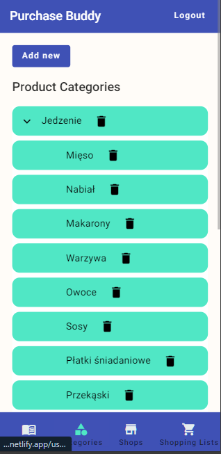
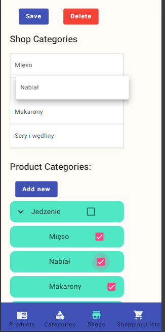
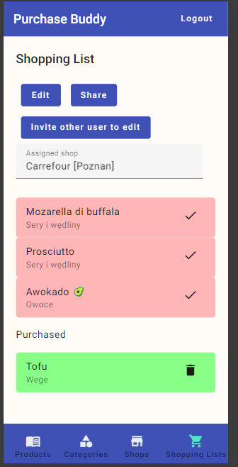

# PurchaseBuddy
[](https://github.com/Shakkozu/PurchaseBuddy/actions/workflows/PurchaseBuddy.yml)

Welcome to PurchaseBuddy, your go-to solution for efficiently managing your shopping lists.

Project was developed with a focus on enhancing skills related to Continuous Integration/Continuous Deployment (CI/CD) and deployment practices.

PurchaseBuddy aims to enhance the shopping experience while enable users to collaborate on shared shopping lists.

## General information

PurchaseBuddy simplifies the task of creating and organizing shopping lists by categorizing items based on their location in the store.
It also allows users to structure shopping lists items according to shop-placement categories, ensuring a smoother and more efficient shopping experience.

Additionally, the project supports collaborative list management, allowing users to share their lists with others and work together on the same list.

### Authentication

I made an authorization flow on my own, i am aware this is anti-pattern, an yet, I wanted to get hands-on creating a simple authentication flow solution to expand my knowledge on this topic

## Technologies

- .NET 7
- Postgres
- Angular

## Launch

Project is hosted on azure under https://purchasebuddy.netlify.app

## Additional comments

Project does not contain unified structure.
During this project I've experimented with various options how to organize code, thats why some of the features are organized in vertical-slice concepts
```
src/purchases/CloningListsToOtherUsers
src/purchases/GrantOtherUsersAccessToShoppingLists
```
And some features are located with layered structure
```
src/purchases/domain/ImportedShoppingListItem.cs
src/purchases/domain/ShoppingList.cs
src/purchases/domain/ShoppingListItem.cs
src/purchases/app/ShoppingListReadService.cs
src/purchases/app/ShoppingListWriteService.cs
```


[Angular project is placed in separate github repository](https://github.com/Shakkozu/PurchaseBuddy.AngularUI)


## Gallery
|Defining Products|Product categories list|Defining shop configuration | Working on shopping list|
|-|-|-|-|
|||

 
 
 

 
